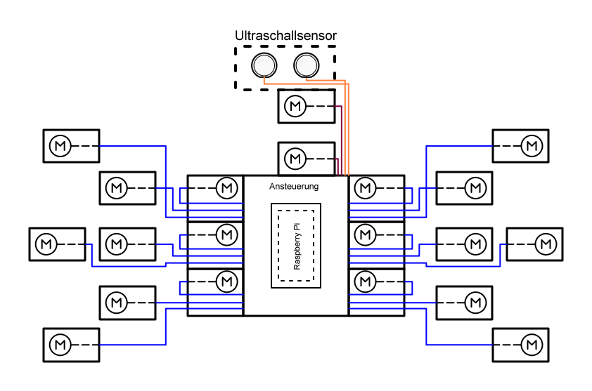
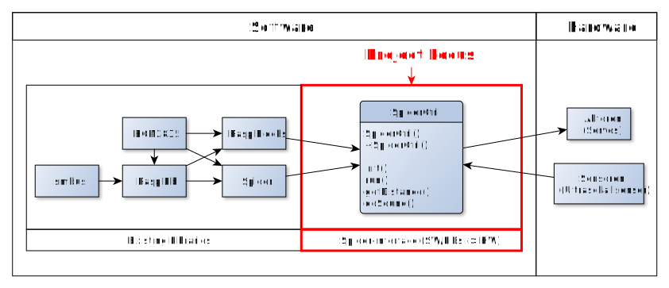
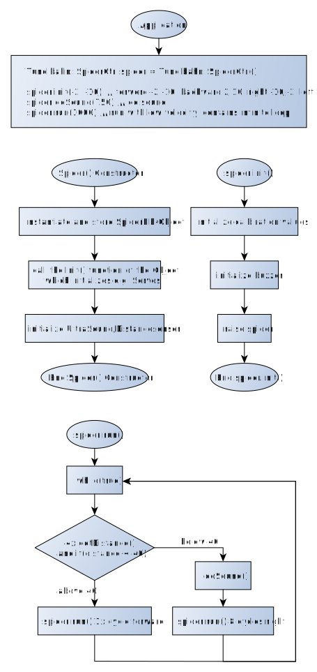

# Spider - Project description

This document describes the architecture and implementation considerations of the project Spider.

## Scope

The project's scope is from designing the software-design-flow to the actual implementation and
execution.

### Requirements

The following requirements have to be considered:

The spider should be able to ...
- ... stand firmly.
- ... move forword with a constant speed.
- ... recognize a wall in front of it.

### Infrastructure

The Code for the Spider is written in C++.

## User Model

Due to the fact that the spider
operates independetly from any user input after the
power up, there is no user model to describe.
Moreover there will be no e.g. socket or generally
spoken interface offered to the user.

### Domain Use Cases

#### UC1 - Startup

The startup-procedure is defined as follows:

__Precondition:__ 

The raspberry is powerd up and 
accessable via ssh to start the program.

__Scenario 1:__ 

Program gets started by the user.

__Scenario 2:__

Program gets stoped by the user via CTRL-C.

## Domain Model

This chapter describes the role of the Spider 
in the context of the Spider.

### Big Picture

<!--
## Architecture Model

This chapter describes the architecture model of the Spider.

### Key Design Decisions

__KDD 1:__ 

__KDD 2:__ 

__KDD 3:__ 
-->

<!--
### System Context

### System Decomposition

### External Dependencies

### Threading Model

-->

### Static Architecture

This chapter describes the components of the static architecture of the Spider.

The following figure gives a complete overview of all software components which are 
necessary to control the spider:

<!--
#### Component1

The RDFHost is the main component. It is responsible for initializing 
all the other components, and it provides the Remoting component 
and the Plugin Manager component. This is the main entry point 
of the application.

#### Component2

### Configuration

### Dynamic Architecture

In this chapter we discuss the dynamic behavior of the Spider.

#### Startup

#### Shutdown

## Operational Qualities

### Performance

### Availability

## System Deployment

## Testability

## Implementation Details

-->

### Flowchart

### Implementation Decisions / Limitations

- The spider should not interact with the user after startup
- The spider doesn't use the camera to avoid using OpenCV

### (Special) classes

* SpiderCtrl: This class is considered as the root-class which provides functions to initialize all sensors and actors, bring the spider in the starting position and make the spider start moving.

<!--
MovtCtrl: This class is used as helper-class in the project scope to provide the root-class with all necessary sub-functions.

### (Special) Algorithms

...
-->

